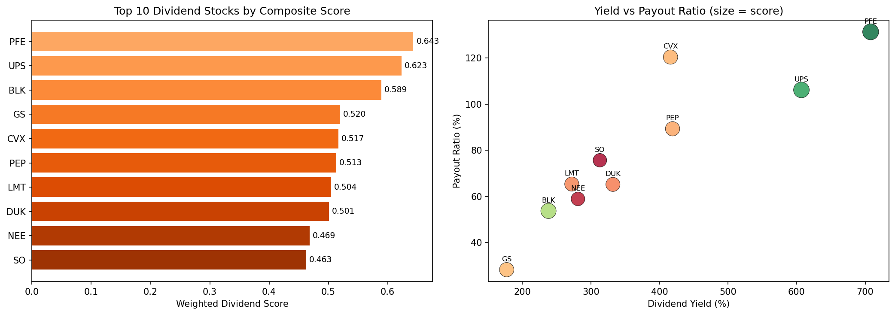

# Dividend Investing Algorithm

A quantitative dividend stock screener that identifies the top 10 income-generating securities from the S&P 500 by analysing dividend yield, payout sustainability, and growth history.

## Overview

This algorithm evaluates S&P 500 securities using a weighted normalisation model across five dividend metrics. It balances high current income against long-term dividend sustainability, with payout ratio inverse-scored to favour companies with room to maintain and grow their dividends.

## Methodology

| Metric | Weight | Direction | Rationale |
|--------|--------|-----------|-----------|
| **Dividend Yield** | 30% | Higher is better | Current income return |
| **Dividend Rate** | 20% | Higher is better | Absolute dollar payout |
| **Payout Ratio** | 20% | Lower is better | Sustainability indicator |
| **5-Year Avg Yield** | 20% | Higher is better | Consistency over time |
| **Earnings Growth** | 10% | Higher is better | Future dividend growth potential |

## Tools & Libraries

- **Python** (pandas, NumPy, yfinance, SciPy, matplotlib)
- Dividend and fundamental data via Yahoo Finance API
- Min-max normalisation with custom weighting

## Key Outputs

- Weighted dividend composite scores
- Top 10 income-generating securities
- Yield vs. payout ratio scatter analysis
- Dividend sustainability visualisation

## Sample Output

## Project Type

Personal Project

## Usage

Open [`dividend_investing.ipynb`](dividend_investing.ipynb) for the full implementation and walkthrough.
